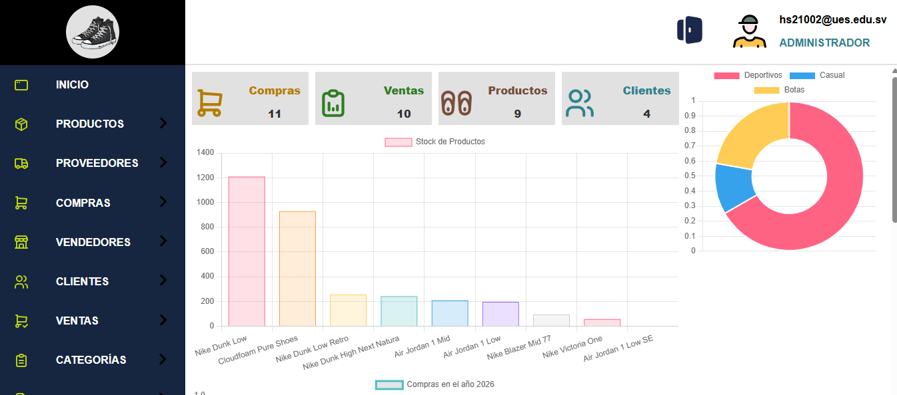
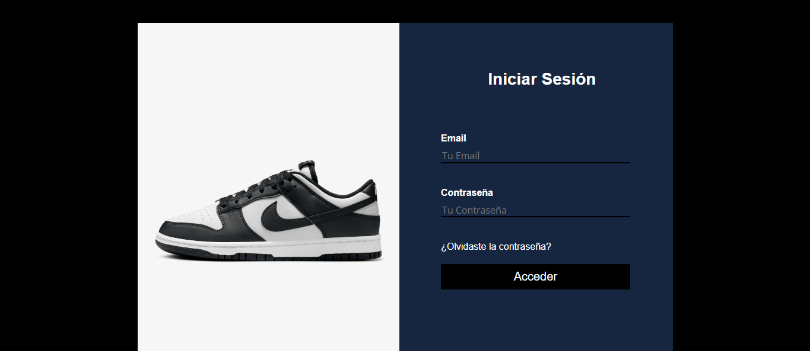
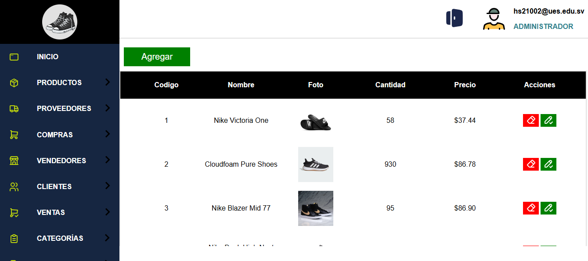
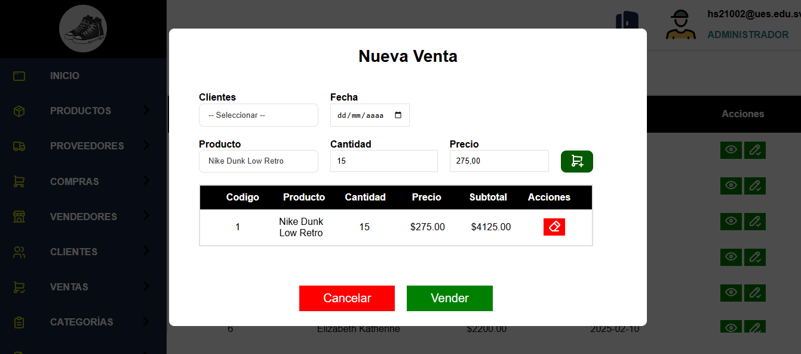
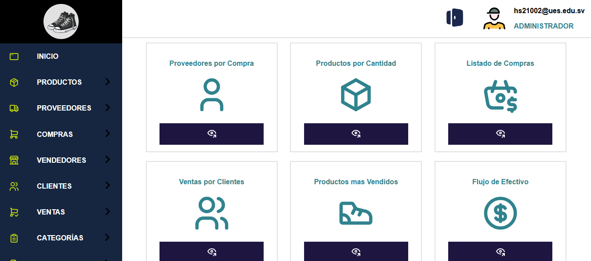
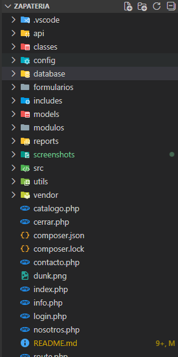

# Sistema informático web para compra y venta de la zapateria Jadez, distrito Cuscatlán, Cuscatlán sur



Sistema web desarrollado para la gestión de compra y venta de productos,
incluye autenticación de usuarios, módulos completos y reportes en PDF.

## 🛠 Tecnologías
- PHP 8
- JavaScript
- HTML5 / CSS3 / Bootstrap
- MySQL
- Apache
- FPDF
- PhpMailer

## ✨ Funcionalidades
- Autenticación de usuarios (login/logout)
- Gestión de productos
- Gestión de proveedores
- Gestión de compras
- Gestión de vendedores
- Gestión de clientes
- Gestión de ventas
- Gestión de categorías
- Generación de reportes en PDF
- Gestión de correos
- Validaciones en backend
- Estadísticas

## 📸 Capturas

### Login


### Listado de productos


### Venta


### Reportes


### Página web


## 🚀 Instalación

1. Clonar el repositorio
```bash
git clone https://github.com/javierhernandezprogramador-stack/zapateria
```

2. Configurar la base de datos en:
```
config/Conexion.php
```

3. Importar el archivo SQL ubicado en:
```
database/schema.sql
```

4.Ejecutar en servidor Apache

## 📂 Estructura del proyecto


## 👨‍💻 Autor
**Javier Eduardo Hernández Sánchez**  
Ingeniero de Sistemas informáticos 
Backend Developer (PHP / Java - Spring Boot)
